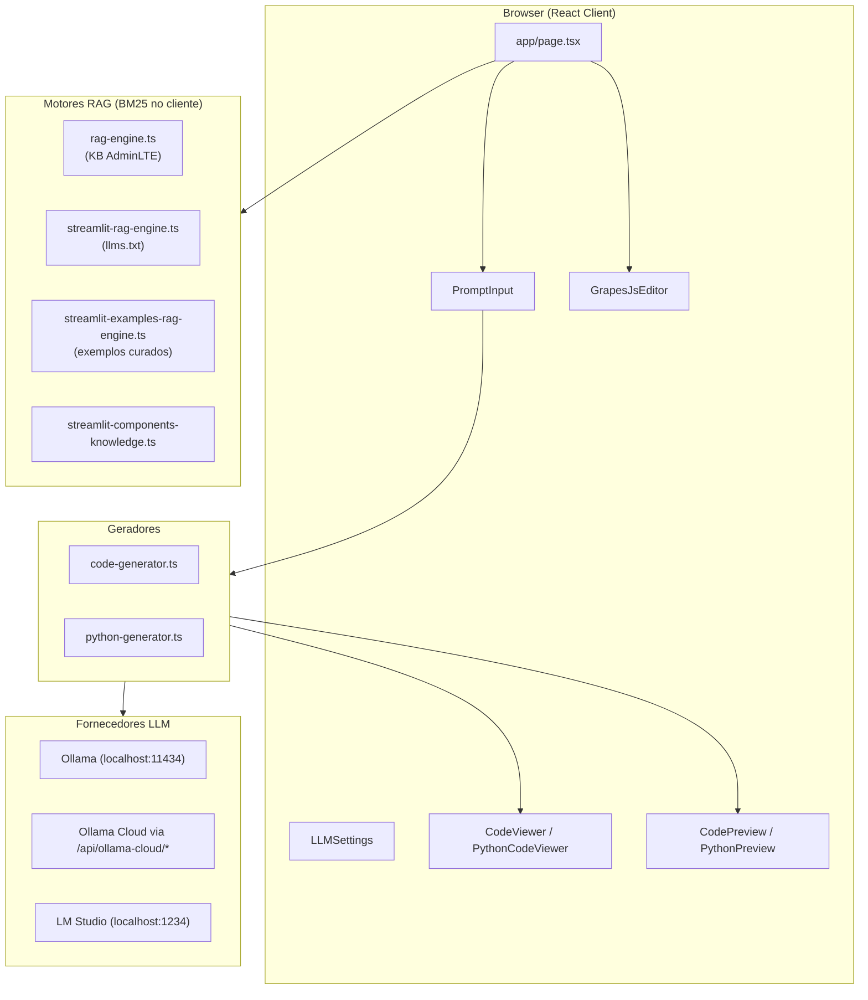
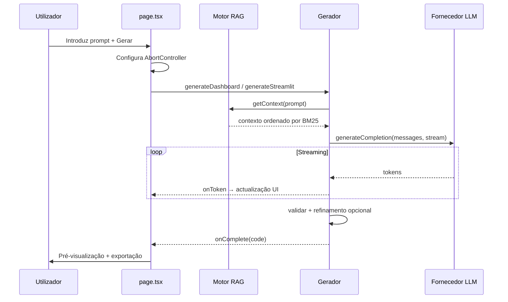

# Arquitectura — Interface Generator

Documentação técnica da aplicação Next.js **Interface Generator**: geração de interfaces com LLMs, RAG e validação pós-geração.

---

## 1. Visão geral

O **Interface Generator** é uma aplicação de página única (SPA) construída com Next.js 16 que utiliza LLMs locais ou na cloud para gerar interfaces a partir de prompts em linguagem natural. Suporta dois modos de saída:

| Modo | Saída | Framework alvo |
|------|-------|----------------|
| **HTML** | Dashboards AdminLTE 3 (HTML/CSS/JS) | AdminLTE 3.2, Bootstrap 4.6, Chart.js, jQuery |
| **Python** | Aplicações Streamlit | Streamlit, Pandas, Plotly |

A aplicação combina **RAG (Retrieval-Augmented Generation)** com prompts de sistema estruturados, validação e passes de refinamento opcionais para produzir código executável. A geração corre no browser para LLMs locais; o Ollama Cloud é acedido através de rotas API Next.js para evitar problemas de CORS.

---

## 2. Arquitectura de alto nível



### Princípios de desenho

- **Cliente pesado**: indexação RAG, pesquisa BM25 e streaming LLM correm no browser (excepto o proxy Ollama Cloud).
- **Sem base de dados**: as bases de conhecimento são dados estáticos em TypeScript ou documentação obtida e mantida em memória.
- **RAG determinístico**: pesquisa BM25 por palavras-chave em vez de embeddings semânticos — mais rápido e sem custo de runtime ML.
- **Reparação pós-geração**: ambos os modos executam validação e refinamento LLM opcional quando a saída está incompleta.

---

## 3. Stack tecnológica

| Camada | Tecnologia |
|--------|------------|
| Framework | Next.js 16.2.6 (App Router) |
| Interface | React 19, Tailwind CSS 4, shadcn/ui (primitivos Radix) |
| Editor visual | GrapesJS 0.22 |
| Clientes LLM | API REST Ollama, API compatível OpenAI (LM Studio) |
| Pesquisa | Implementação BM25 personalizada |
| Exportação | JSZip |
| Analytics | Vercel Analytics (apenas em produção) |
| Linguagem | TypeScript 5.7 (modo strict) |
| Gestor de pacotes | pnpm |

---

## 4. Estrutura do projecto

```
interface_generator/
├── app/
│   ├── layout.tsx              # Layout raiz, tipos de letra, metadados    
│   ├── page.tsx                # Aplicação principal (client component)    
│   ├── globals.css             # Tailwind + design tokens                  
│   └── api/
│       ├── ollama-cloud/
│       │   ├── chat/route.ts   # Proxy de chat em streaming para ollama.com            
│       │   └── tags/route.ts   # Proxy de listagem de modelos                          
│       ├── streamlit-docs/route.ts      # Obtém e analisa docs.streamlit.io/llms.txt   
│       ├── streamlit-examples/route.ts  # Serve exemplos Streamlit curados             
├── components/
│   ├── ui/                     # Primitivos shadcn/ui (~50 componentes)         
│   ├── llm-settings.tsx        # Diálogo de configuração do fornecedor/modelo   
│   ├── prompt-input.tsx        # Área de prompt, exemplos, fluxo de plano       
│   ├── code-viewer.tsx         # Separadores de código HTML + exportação        
│   ├── code-preview.tsx        # Pré-visualização em iframe                     
│   ├── python-code-viewer.tsx  # Visualizador Python + editor por chat              
│   ├── python-preview.tsx      # Instruções de execução Streamlit               
│   ├── grapesjs-editor.tsx     # Modal do editor visual HTML                    
│   ├── generation-status.tsx                                                    
│   ├── output-mode-selector.tsx                                                 
│   └── rag-status.tsx                                                           
├── lib/                                                               
│   ├── llm-client.ts               # Abstracção LLM + streaming               
│   ├── rag-engine.ts               # RAG BM25 AdminLTE                        
│   ├── knowledge-base.ts           # ~38 entradas de componentes AdminLTE     
│   ├── code-generator.ts           # Pipeline de geração HTML                 
│   ├── python-generator.ts         # Pipeline de geração Streamlit 
│   ├── streamlit-rag-engine.ts                                             
│   ├── streamlit-examples-rag-engine.ts                                
│   ├── streamlit-components-knowledge.ts                             
│   ├── file-exporter.ts            # Exportação HTML/ZIP              
│   ├── python-file-exporter.ts                                          
│   ├── python-code-editor.ts       # Edições Python por chat                
│   ├── visual-editor-ai.ts         # Operações de edição IA no GrapesJS           
│   ├── grapesjs-blocks.ts          # Blocos AdminLTE para GrapesJS              
│   ├── nicegui-rag-engine.ts       # Legado (não ligado ao fluxo principal)    
│   └── utils.ts                                                                
├── hooks/                      # use-mobile, use-toast            
├── API Simulator/              # Servidor mock REST/SSE autónomo  
│   └── mock-api-server.js     
├── next.config.mjs      
├── tsconfig.json        
└── package.json         
```

---

## 5. Ponto de entrada da aplicação

Toda a interface reside numa única página cliente: `app/page.tsx` (`DashboardGenerator`).

### Estado gerido ao nível da página

| Grupo de estado | Finalidade |
|-----------------|------------|
| `llmConfig` | Fornecedor, URL base, modelo, modo de qualidade, chave API |
| `outputMode` | `'html'` ou `'python'` |
| `ragEngine` / `streamlitRagEngine` / `examplesEngine` | Instâncias dos motores RAG |
| `generationState` | `idle` → `searching` → `generating` → `refining` → `complete` / `error` / `cancelled` |
| `plan` / `planState` | Plano de implementação opcional antes da geração |
| `generatedCode` / `generatedPythonCode` | Resultado final |
| `abortControllerRef` | Cancelamento de pedidos LLM em curso |

### Sequência de arranque

No mount, três `useEffect` inicializam os motores RAG em paralelo:

1. **RAG AdminLTE** — indexa `ADMINLTE_KNOWLEDGE` (~38 itens) via BM25
2. **RAG documentação Streamlit** — obtém `/api/streamlit-docs`, indexa `llms.txt` analisado
3. **RAG exemplos** — obtém `/api/streamlit-examples`, indexa 6 dashboards curados

A geração HTML fica bloqueada até o estado RAG AdminLTE ser `'ready'`.

---

## 6. Pipeline de geração

### 6.1 Modo HTML (`lib/code-generator.ts`)

```
Prompt do utilizador (+ plano opcional)
        ↓
Pesquisa RAG (topK=7) → contexto de componentes AdminLTE
        ↓
Stream LLM (SYSTEM_PROMPT + contexto + prompt amplificado)
        ↓
Pós-processamento:
  • normaliseFramework() — reescreve Tailwind/Bootstrap5 → AdminLTE/Bootstrap4
  • validateHtml() — verifica completude
  • Pass de refinamento opcional se a validação falhar
        ↓
parseGeneratedCode() → { html, css, js, fullHtml, dependencies }
        ↓
createPreviewHtml() → documento pronto para iframe com scripts CDN
```

**Stack CDN** (fonte única em `ADMINLTE_CDN_STYLES` / `ADMINLTE_CDN_SCRIPTS`):

- AdminLTE 3.2 CSS (inclui estilos Bootstrap 4)
- Font Awesome 6.4
- jQuery 3.6, bundle JS Bootstrap 4.6, AdminLTE JS, Chart.js

**Fluxo de planeamento** (opcional):

- `generatePlan()` — plano estruturado em texto com contexto RAG (topK=3)
- `amendPlan()` — alterações pontuais ao plano por instrução do utilizador
- Re-planear — revisão e melhoria completa do plano

### 6.2 Modo Python (`lib/python-generator.ts`)

```
Prompt do utilizador (+ plano opcional)
        ↓
Consulta de cache (localStorage, TTL 2h, chave prompt+modelo)
        ↓
RAG: docs Streamlit (topK=8) + exemplos (topK=2) + componentes de terceiros
        ↓
Stream LLM (PYTHON_SYSTEM_PROMPT + contextos)
        ↓
Pós-processamento:
  • stripCodeFences(), stripPreamble()
  • autoFixCommonErrors()
  • validatePython()
  • Até 2 passes de refinamento com prompts específicos por problema
        ↓
{ python, requirements } → cacheSet()
```

A **validação** cobre regras da API Streamlit: ordem de `st.set_page_config`, chaves únicas de widgets, argumentos de cor Plotly, APIs Pandas obsoletas, etc.

---

## 7. Sistemas RAG

Todos os motores RAG utilizam **BM25** com boosts por campo. Sem embeddings (`@xenova/transformers` está no `package.json` mas não é importado em lado nenhum).

### 7.1 RAG AdminLTE (`lib/rag-engine.ts`)

| Propriedade | Valor |
|-------------|-------|
| Fonte | `lib/knowledge-base.ts` — 38 itens curados |
| Categorias | `primitive`, `pattern`, `component`, `widget`, `chart`, `layout`, `utility` |
| Expansão de consultas | Termos PT→EN, sinónimos estruturais |
| Formato do contexto | Secções Markdown agrupadas por categoria |

Cada `KnowledgeItem` inclui: `id`, `name`, `category`, `description`, `html`, `css`/`js` opcionais, `tags`, `composableWith`.

### 7.2 RAG documentação Streamlit (`lib/streamlit-rag-engine.ts`)

| Propriedade | Valor |
|-------------|-------|
| Fonte | `GET /api/streamlit-docs` → `https://docs.streamlit.io/llms.txt` |
| Campos indexados | título (boost 3×), conteúdo, código demo (boost 2×) |
| Cache no servidor | 1 hora (`revalidate: 3600`) |

### 7.3 RAG exemplos (`lib/streamlit-examples-rag-engine.ts`)

| Propriedade | Valor |
|-------------|-------|
| Fonte | `GET /api/streamlit-examples` — 6 exemplos incorporados |
| Padrões | Dashboard KPI, Plotly interactivo, tabela filtrável, monitor em tempo real, admin multi-página, financeiro OHLCV |
| Campos indexados | título (2,5×), tags (3×), tokens de descrição + código |

### 7.4 Componentes de terceiros (`lib/streamlit-components-knowledge.ts`)

Base de conhecimento estática para componentes comunitários Streamlit (mapas, grelhas, autenticação, media, etc.). Injectada quando `detectRequiredComponents(prompt)` corresponde a tags.

---

## 8. Integração LLM (`lib/llm-client.ts`)

### Fornecedores suportados

| Fornecedor | URL predefinida | Protocolo | Notas |
|------------|-----------------|-----------|-------|
| `ollama` | `http://127.0.0.1:11434` | Ollama `/api/chat`, `/api/tags` | Envia `options` (temperature, num_ctx, etc.) |
| `ollama-cloud` | `https://ollama.com` (via proxy) | Idem, através de rotas Next.js | Requer chave API no header `x-ollama-api-key` |
| `lmstudio` | `http://127.0.0.1:1234` | OpenAI `/v1/chat/completions`, `/v1/models` | Formato SSE `data:` |

### Modos de qualidade

| Modo | Temperature | num_predict | num_ctx |
|------|-------------|-------------|---------|
| `fast` | 0,5 | 5500 | 12288 |
| `quality` | 0,7 | 8192 | 16384 |
| `custom` | Slider do utilizador (0,1–1,0) | Interpolado entre presets | Interpolado |

### Comportamento de streaming

- **Timeout de inactividade**: 180 segundos sem actividade de rede
- **Saída antecipada**: pára quando `</html>` é detectado (modo HTML)
- **Cancelamento**: `AbortController` propagado desde o botão Cancelar na UI
- **Erros Ollama Cloud**: subscrição necessária (403), chave inválida (401), modelo desconhecido (404) com mensagens accionáveis

### Persistência da chave API

As chaves Ollama Cloud são guardadas em `localStorage` com a chave `ollama-cloud-api-key` (apenas no cliente).

---

## 9. Rotas API

### `POST /api/ollama-cloud/chat`

Faz proxy do chat em streaming para `https://ollama.com/api/chat`.

- Requer header: `x-ollama-api-key`
- Remove o sufixo `-cloud` dos nomes de modelo
- Devolve stream `application/x-ndjson`

### `GET /api/ollama-cloud/tags`

Faz proxy da listagem de modelos para `https://ollama.com/api/tags`.

### `GET /api/streamlit-docs`

Obtém e analisa o `llms.txt` do Streamlit em `DocEntry[]` (`title`, `content`, `format`, `url`, `demo` opcional).

### `GET /api/streamlit-examples`

Devolve 6 objetos `ExampleEntry` incorporados (sem fetch externo). Cache: 24 horas.

### `GET /api/nicegui-docs`

Implementação idêntica a `streamlit-docs` — legado, não utilizado na UI principal.

---

## 10. Componentes da interface

### Entrada de prompt (`components/prompt-input.tsx`)

- Área de texto com biblioteca de exemplos (SCADA, IoT, manufactura, etc.)
- Pesquisa difusa sobre palavras-chave dos exemplos
- **Fluxo de plano**: Planear → Rever → Alterar → Gerar
- Suporte de cancelamento durante plano ou geração

### Visualizador de código — HTML (`components/code-viewer.tsx`)

- Separadores: HTML completo, corpo HTML, CSS, JS
- Copiar, descarregar `.html`, exportar ZIP (via `lib/file-exporter.ts`)
- Scroll automático durante streaming

### Visualizador de código — Python (`components/python-code-viewer.tsx`)

- Separadores: `app.py`, `requirements.txt`
- Copiar, descarregar, exportar ZIP
- **Modo editor por chat**: alterações em linguagem natural via `lib/python-code-editor.ts`

### Pré-visualização — HTML (`components/code-preview.tsx`)

Renderiza o HTML gerado num `<iframe>` com controlos de actualizar e ecrã inteiro.

### Pré-visualização — Python (`components/python-preview.tsx`)

Mostra metadados da app (título, número de linhas, widgets) e comandos copiáveis `pip install` / `streamlit run`. Não executa Python no browser.

### Editor visual (`components/grapesjs-editor.tsx`)

Modal de ecrã inteiro com:

- Canvas GrapesJS com CDN AdminLTE injectado
- Blocos AdminLTE personalizados (`lib/grapesjs-blocks.ts`)
- Pré-visualização responsiva (Desktop/Tablet/Mobile)
- Painel de assistente IA com operações de edição JSON (`lib/visual-editor-ai.ts`)
- Painéis de desfazer/refazer, camadas, estilos e atributos

### Definições LLM (`components/llm-settings.tsx`)

Diálogo para selecção de fornecedor, URL, modelo (de `/api/tags` ou `/v1/models` em tempo real), modo de qualidade, slider de temperature personalizada e teste de ligação.

---

## 11. Exportação

### Exportação HTML (`lib/file-exporter.ts`)

Conteúdo do ZIP:

- `index.html` — documento completo com ligações CDN
- `css/custom.css` (se existir CSS personalizado)
- `js/app.js` (se existir JS personalizado)
- `README.md` — metadados da geração + guia de integração API
- Modelo `config.js` para ligação a APIs REST

Inclui `injectRuntimeGuard()` para inicialização segura do Chart.js.

### Exportação Python (`lib/python-file-exporter.ts`)

Conteúdo do ZIP:

- `app.py`
- `requirements.txt`
- `README.md` com instruções de execução

---

## 12. Simulador de API (auxiliar)

`API Simulator/mock-api-server.js` é um servidor Node.js autónomo para testar dashboards gerados com dados simulados.

| Padrão de endpoint | Comportamento |
|--------------------|---------------|
| `GET /api/*` | Respostas JSON instantâneas (sensores, equipamentos, KPIs, etc.) |
| `GET /api/stream/*` | Server-Sent Events, push a cada 10 s |
| `GET /api/routes` | Lista todos os endpoints disponíveis |

Porta predefinida: **3001** (`node mock-api-server.js --port 8888` para alterar).

---

## 13. Configuração

### `next.config.mjs`

```javascript
{
  typescript: { ignoreBuildErrors: true },  // compila apesar de erros TS
  images: { unoptimized: true }
}
```

### `tsconfig.json`

- Alias de caminho: `@/*` → raiz do projecto
- Modo strict activado
- Target: ES6

### Variáveis de ambiente

Não é necessário ficheiro `.env`. A aplicação utiliza:

- `localStorage` do browser para a chave API Ollama Cloud e cache de geração Python
- URLs LLM predefinidas no código

`.env*.local` está no `.gitignore`.

---

## 14. Desenvolvimento e implantação

### Scripts

```bash
pnpm dev      # next dev
pnpm build    # next build
pnpm start    # next start
pnpm lint     # eslint .
```

### Pré-requisitos para funcionalidade completa

1. **Modo HTML**: Ollama local ou LM Studio com um modelo de código adequado
2. **Modo Python**: O mesmo LLM; o utilizador executa o código localmente com Python 3.x + Streamlit
3. **Ollama Cloud** (opcional): chave API de [ollama.com/settings/keys](https://ollama.com/settings/keys)

### Notas de implantação

- Concebida como **ferramenta local**; sem autenticação nem multi-tenancy
- As rotas proxy Ollama Cloud requerem `fetch` no servidor para `ollama.com`
- Vercel Analytics só carrega com `NODE_ENV === 'production'`
- `ignoreBuildErrors: true` permite implantação com avisos TypeScript

---

## 15. Fluxo de dados



---

## 16. Tipos principais

```typescript
// lib/llm-client.ts
interface LLMConfig {
  provider: 'ollama' | 'ollama-cloud' | 'lmstudio'
  baseUrl: string
  model: string
  qualityMode?: 'fast' | 'quality' | 'custom'
  customTemperature?: number
  apiKey?: string
}

// lib/code-generator.ts
interface GeneratedCode {
  html: string
  css: string
  js: string
  fullHtml: string
  dependencies: string[]
}

// lib/python-generator.ts
interface GeneratedPythonCode {
  python: string
  requirements: string
}

// components/generation-status.tsx
type GenerationState =
  | 'idle' | 'searching' | 'generating' | 'refining'
  | 'complete' | 'error' | 'cancelled'
```

---

## 17. Limitações e artefactos legados

| Item | Notas |
|------|-------|
| `@xenova/transformers` | Listado nas dependências mas não utilizado (RAG migrado para BM25) |
| `lib/nicegui-rag-engine.ts` | Presente mas não ligado à UI principal |
| `app/api/nicegui-docs/route.ts` | Duplicado da rota streamlit-docs |
| `SUGGESTED_MODELS` | Arrays vazios — modelos vêm de consultas ao fornecedor em tempo real |
| Pré-visualização Python | Apenas informativa; não executa Streamlit no browser |
| `typescript.ignoreBuildErrors` | Builds de produção podem incluir erros TS |
| Armazenamento da chave API | `localStorage` em texto simples — inadequado para ambientes partilhados |
| CORS | Ollama/LM Studio local devem permitir a origem do browser, ou usar proxy Ollama Cloud |

---

## 18. Pontos de extensão

Para alargar a aplicação:

1. **Novo framework de UI** — Adicionar base de conhecimento, motor RAG, módulo gerador, modo em `OutputModeSelector` e componentes de visualização/pré-visualização
2. **Novo fornecedor LLM** — Estender `LLMProvider`, `testConnection()` e adicionar função `generateWith*` em `llm-client.ts`
3. **Entradas na base de conhecimento** — Adicionar itens a `ADMINLTE_KNOWLEDGE` ou `STREAMLIT_COMPONENTS`
4. **Exemplos Streamlit** — Adicionar entradas a `DASHBOARD_EXAMPLES` em `app/api/streamlit-examples/route.ts`
5. **Blocos GrapesJS** — Estender `lib/grapesjs-blocks.ts`
