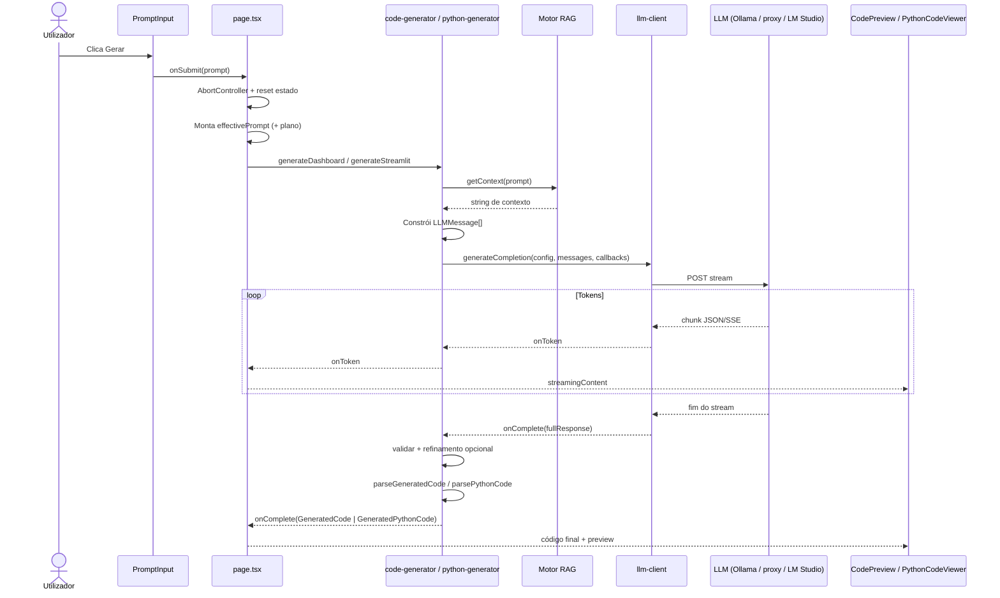
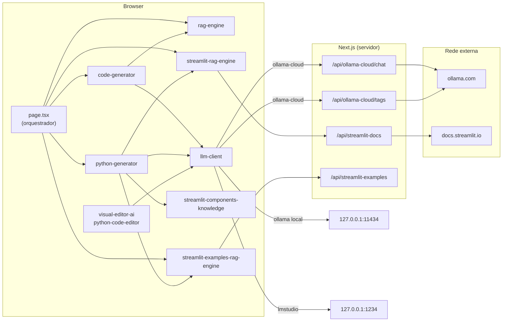
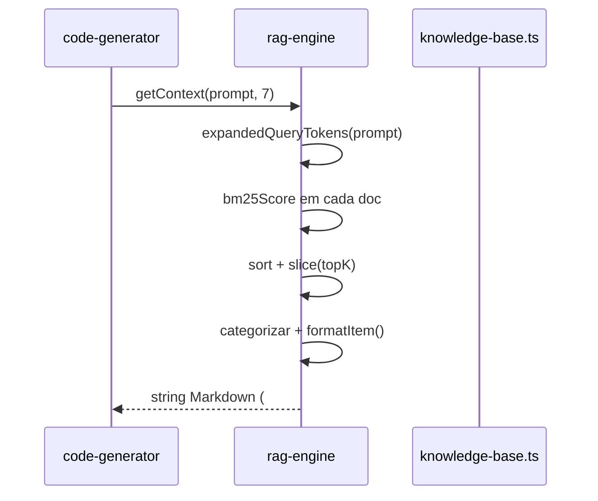
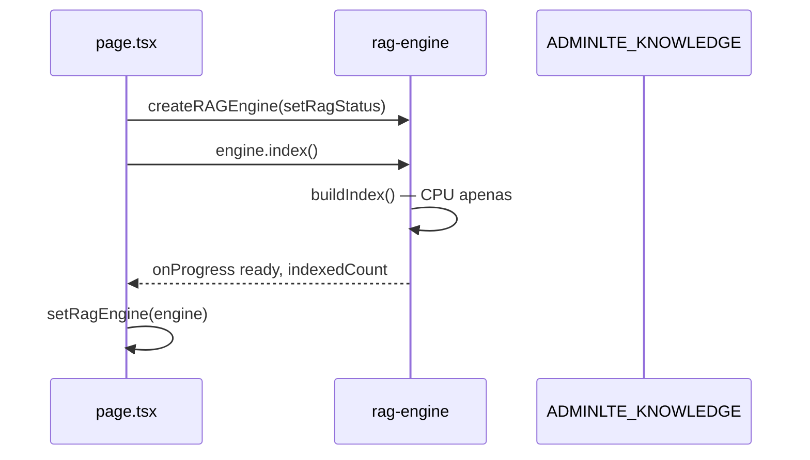
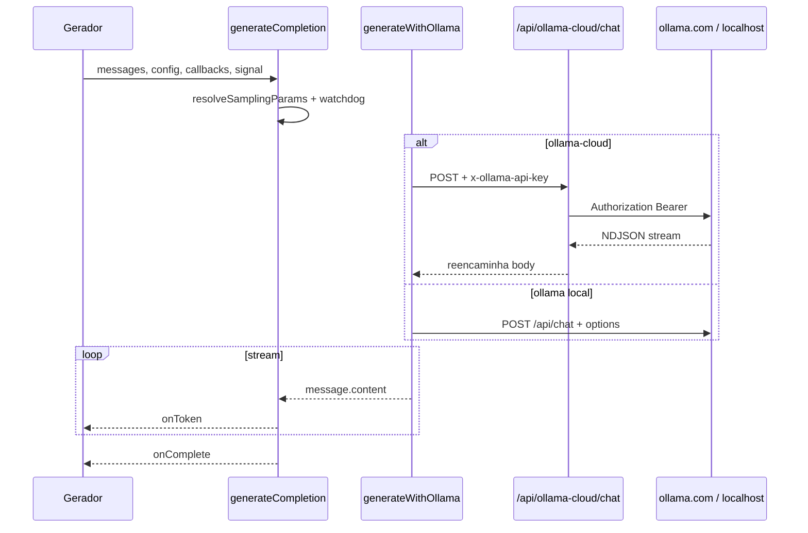
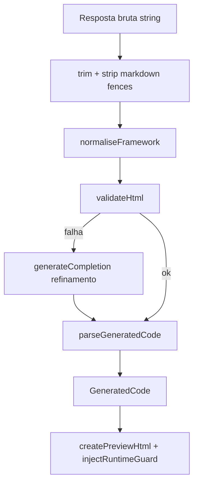
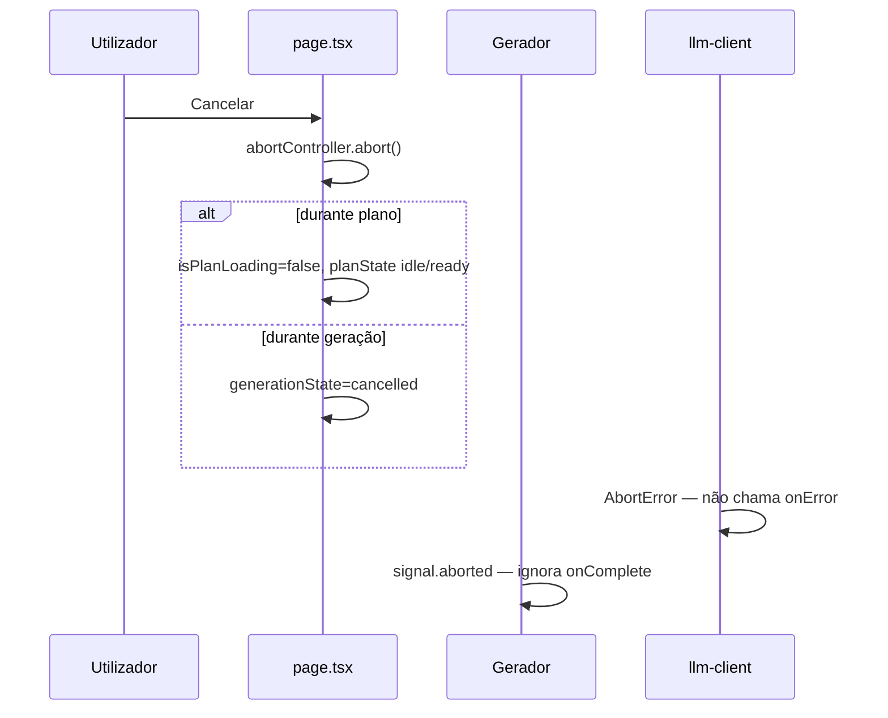
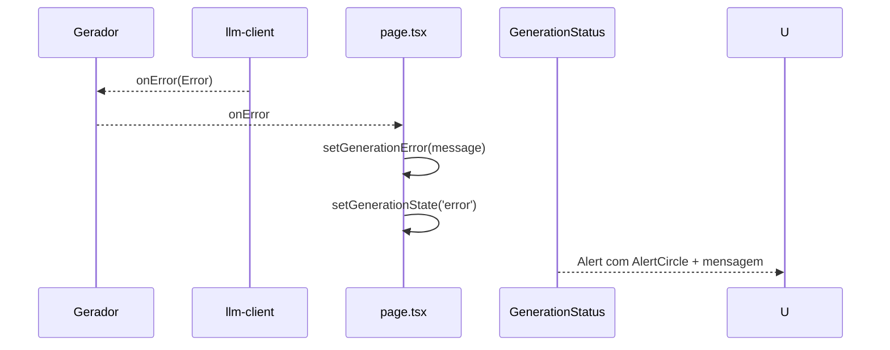

# Fluxos internos — Interface Generator

Guia para um novo programador que precisa de perceber **como a aplicação funciona por dentro**, sem mapa de pastas. Foca-se em ciclos de vida, comunicação entre módulos, transformações de dados e caminhos de erro.

---

## Como ler este documento

Cada secção descreve um **fluxo de trabalho** com:

1. **Passos de execução** — ordem exacta do que acontece
2. **Diagrama de sequência** — quem chama quem
3. **Ficheiros fonte** — onde vive o código
4. **Funções principais** — pontos de entrada
5. **Entradas e saídas** — dados em cada etapa

A aplicação é essencialmente um **orquestrador no browser**: a página principal (`app/page.tsx`) gere estado, chama geradores em `lib/`, estes consultam motores RAG e invocam o LLM via `lib/llm-client.ts`. As rotas API Next.js só entram em jogo para contornar CORS (Ollama Cloud) e para obter documentação Streamlit no servidor.

---

## 1. Ciclo de vida de um pedido de geração (ponta a ponta)

### 1.1 Visão geral

Quando o utilizador clica **Gerar**, o fluxo completo atravessa a UI, o gerador adequado ao modo (HTML ou Python), o RAG, o cliente LLM e, opcionalmente, passes de refinamento e parsing.

### 1.2 Passos de execução

| # | Etapa | O que acontece |
|---|--------|----------------|
| 1 | **Entrada na UI** | `PromptInput` chama `onSubmit(prompt)` definido em `app/page.tsx` → `handleSubmit` |
| 2 | **Pré-condição** | Se `ragEngine` (AdminLTE) for `null`, define erro e pára. Modo Python ainda exige AdminLTE RAG pronto (verificação partilhada) |
| 3 | **Cancelamento anterior** | `abortControllerRef.current?.abort()` — cancela qualquer geração ou plano em curso |
| 4 | **Novo AbortController** | Criado e guardado em `abortControllerRef` |
| 5 | **Reset de estado** | `generationState = 'searching'`, limpa erro, streaming, código gerado, tempo |
| 6 | **Prompt efectivo** | Se existir plano: `prompt + <implementation_plan>...</implementation_plan>` |
| 7 | **Atraso artificial** | `await setTimeout(500ms)` — transição visual para «searching» |
| 8 | **Verificação de abort** | Se cancelado → `generationState = 'cancelled'` e return |
| 9 | **Estado generating** | `generationState = 'generating'` |
| 10 | **Desvio por modo** | `outputMode === 'python'` → `generateStreamlit(...)` ; senão → `generateDashboard(...)` |
| 11 | **RAG + prompt** | Gerador obtém contexto BM25, monta mensagens, chama `generateCompletion` |
| 12 | **Streaming** | Cada token → `onToken` → `flushSync` + `setStreamingContent` na UI |
| 13 | **onComplete do LLM** | Validação, normalização (HTML) ou auto-fix (Python), refinamento opcional |
| 14 | **Parsing final** | `parseGeneratedCode` ou `parsePythonCode` → estrutura tipada |
| 15 | **Callback UI** | `onComplete(code)` → actualiza estado, `generationState = 'complete'`, regista tempo |
| 16 | **Pré-visualização** | HTML: `createPreviewHtml` → `CodePreview` iframe. Python: `PythonPreview` (metadados + comandos) |

### 1.3 Diagrama de sequência



### 1.4 Ficheiros e funções

| Ficheiro | Funções |
|----------|---------|
| `components/prompt-input.tsx` | Dispara `onSubmit`, `onPlan`, `onCancel` |
| `app/page.tsx` | `handleSubmit`, `handleCancel`, `handlePlan`, `handleAmendPlan`, `handleReplan` |
| `lib/code-generator.ts` | `generateDashboard`, `parseGeneratedCode`, `createPreviewHtml` |
| `lib/python-generator.ts` | `generateStreamlit`, `parsePythonCode`, `cacheGet` / `cacheSet` |
| `lib/llm-client.ts` | `generateCompletion`, `generateWithOllama`, `generateWithLMStudio` |

### 1.5 Entradas e saídas por etapa

| Etapa | Entrada | Saída |
|-------|---------|-------|
| `handleSubmit` | `prompt: string`, `plan`, `llmConfig`, `outputMode`, motores RAG | Side-effects de estado React; chama gerador |
| `generateDashboard` / `generateStreamlit` | prompt, `LLMConfig`, motor(es) RAG, callbacks, `AbortSignal` | `void` (resultado via callbacks) |
| `onToken` | `token: string` | Actualização incremental da UI |
| `onComplete` (gerador) | `GeneratedCode` ou `GeneratedPythonCode` | Estado final + pré-visualização |

---

## 2. Comunicação entre serviços internos

A aplicação **não tem microserviços**. A «comunicação interna» é entre módulos TypeScript no cliente e rotas API no servidor Next.js.

### 2.1 Mapa conceptual



### 2.2 Contratos entre módulos

| De | Para | Interface | Transporte |
|----|------|-----------|------------|
| `page.tsx` | Motores RAG | `RAGEngine`, `StreamlitRAGEngine`, `ExamplesRAGEngine` | Chamadas síncronas/async em memória |
| Geradores | RAG | `getContext(query, topK?) → string` | Promise (AdminLTE) ou sync (Streamlit) |
| Geradores | `llm-client` | `generateCompletion(config, messages, callbacks, signal?)` | `fetch` streaming |
| `llm-client` | Ollama Cloud | `POST /api/ollama-cloud/chat`, header `x-ollama-api-key` | Proxy servidor → `ollama.com` |
| Motores Streamlit | Next.js API | `fetch('/api/streamlit-docs')`, `fetch('/api/streamlit-examples')` | HTTP JSON |
| `GrapesJsEditor` | `visual-editor-ai` | `askAI`, `askAIForFragment` | `generateCompletion` + DOM no browser |
| `PythonCodeViewer` | `python-code-editor` | `editPythonCode` | `generateCompletion` |

### 2.3 Singletons em memória

Os motores RAG Streamlit e Exemplos guardam estado ao nível do módulo (`_docs`, `_isIndexed`, `_idf`). O RAG AdminLTE faz o mesmo com `docs`, `isIndexed`. **Um hot-reload ou segunda tab não reinicializa** se `isIndexed` já for verdadeiro — o `index()` retorna imediatamente com progresso `ready`.

---

## 3. Processo de recuperação RAG

Todos os motores usam **BM25** (sem embeddings). O fluxo é: **tokenizar consulta → expandir (PT→EN) → pontuar documentos → ordenar → formatar contexto para o prompt**.

### 3.1 RAG AdminLTE (`lib/rag-engine.ts`)

#### Passos

1. `createRAGEngine(onProgress)` devolve objecto com `index`, `search`, `getContext`
2. `index()` → `indexKnowledgeBase()` → `buildIndex()` sobre `ADMINLTE_KNOWLEDGE`
3. Para cada `KnowledgeItem`, `createSearchText(item)` agrega nome, descrição, tags, categoria, tokens de classes HTML
4. `tokenize()` normaliza, remove acentos, filtra tokens 2–40 chars
5. Calcula IDF global e comprimento médio de documento
6. Em `search(query, topK)`:
   - `expandedQueryTokens(query)` — consulta original + tradução PT→EN + sinónimos estruturais
   - `bm25Score()` por documento com boosts em `nameTokens` (×2) e `tagTokens` (×1)
7. Em `getContext(query, topK)`:
   - Pesquisa com `topK` alargado (mín. 10)
   - Agrupa por `category` (primitive, pattern, component, widget, chart, layout, utility)
   - Formata secções Markdown com HTML/JS de exemplo

#### Diagrama



| Função | Entrada | Saída |
|--------|---------|-------|
| `buildIndex()` | `ADMINLTE_KNOWLEDGE[]` | Preenche `docs[]`, `idf`, `avgDocLen` |
| `search(query, topK)` | `string`, `number` | `RAGResult[]` com `item` + `score` |
| `getContext(query, topK)` | `string`, `number` | `string` (contexto para LLM, pode ser truncado pelo gerador) |
| `truncateContext` (em code-generator) | contexto, `maxChars=14000` | contexto cortado em secção completa |

### 3.2 RAG documentação Streamlit (`lib/streamlit-rag-engine.ts`)

#### Passos

1. `index()` → `indexStreamlit()` → `fetch('/api/streamlit-docs')`
2. Resposta: `StreamlitDocEntry[]` (`title`, `content`, `format`, `url`, `demo?`)
3. `buildIndex(entries)` — texto combinado título + conteúdo + demo
4. `search` / `getContext` — BM25 com boost título (×3) e demo (×2)
5. `getContext` separa entradas com demo (exemplos) vs referência API

| Função | Entrada | Saída |
|--------|---------|-------|
| `indexStreamlit` | callback progresso | `void`; define `_isIndexed`, `_indexedCount` |
| `getContext(query, 8)` | prompt utilizador | String com secções «Working Examples» e «API Reference» |

### 3.3 RAG exemplos Streamlit (`lib/streamlit-examples-rag-engine.ts`)

#### Passos

1. `index()` → `fetch('/api/streamlit-examples')`
2. 6 exemplos incorporados no servidor (apps Python completos)
3. BM25 com boost tags (×3) e título (×2,5)
4. `getContext(query, 2)` — injecta código Python integral como few-shot estrutural

| Função | Entrada | Saída |
|--------|---------|-------|
| `getContext(query, 2)` | prompt | Apps completos em blocos ` ```python ` |

### 3.4 Componentes de terceiros (`lib/streamlit-components-knowledge.ts`)

**Não é um motor RAG completo** — é uma lista estática `STREAMLIT_COMPONENTS` com pontuação por palavras do prompt.

#### Passos

1. `getComponentContext(prompt, topK)` tokeniza o prompt
2. Pontua cada componente: tag exacta (+5), tag parcial (+3), id/nome (+4), descrição (+2)
3. Top-K componentes → secção Markdown com `install`, `requirements`, `import`, `example`
4. `detectRequiredComponents(python)` — usado em `buildRequirements()` após geração

| Função | Entrada | Saída |
|--------|---------|-------|
| `getComponentContext` | `query`, `topK=3` | `string` ou `''` |
| `detectRequiredComponents` | código Python gerado | linhas `requirements.txt` |

---

## 4. Carregamento das bases de conhecimento

Ocorre **no arranque da aplicação**, em três `useEffect` paralelos em `app/page.tsx`.

### 4.1 Fluxo AdminLTE (síncrono, instantâneo)



| Etapa | Entrada | Saída |
|-------|---------|-------|
| `createRAGEngine` | `ProgressCallback?` | `RAGEngine` |
| `indexKnowledgeBase` | — | `isIndexed=true`, mensagem «Indexed N components» |
| UI | `ragStatus.status === 'ready'` | `PromptInput` deixa de estar `disabled` |

### 4.2 Fluxo Streamlit docs (rede + indexação)

| # | Passo | Detalhe |
|---|--------|---------|
| 1 | Cliente | `createStreamlitRAGEngine` → `index()` |
| 2 | Progresso | `status: 'fetching'` |
| 3 | HTTP | `GET /api/streamlit-docs` |
| 4 | Servidor | `fetch('https://docs.streamlit.io/llms.txt')`, `parseLlmsTxt`, cache 1h |
| 5 | Cliente | JSON → `buildIndex(entries)` |
| 6 | Progresso | `status: 'ready'`, `indexedCount` |

**Erro:** `onProgress({ status: 'error', message })` + `throw` — badge Streamlit mostra erro; geração Python continua **sem** contexto de docs.

### 4.3 Fluxo exemplos Streamlit

Idêntico ao anterior, mas `GET /api/streamlit-examples` devolve JSON estático (sem fetch externo no servidor).

**Erro:** capturado em `page.tsx` com `console.warn` — **não bloqueia** a aplicação; few-shot examples ficam indisponíveis.

### 4.4 O que não é carregado automaticamente

- `nicegui-rag-engine.ts` — existe mas **não é inicializado** em `page.tsx`
- `@xenova/transformers` — dependência morta; BM25 substituiu embeddings

---

## 5. Construção do prompt

O prompt enviado ao LLM é um array `LLMMessage[]` com papéis `system`, `user`, `assistant` (mensagens assistant simulam confirmação de contexto).

### 5.1 Modo HTML — geração (`generateDashboard`)

#### Estrutura das mensagens

| Ordem | Role | Conteúdo |
|-------|------|----------|
| 1 | `system` | `SYSTEM_PROMPT` — regras AdminLTE 3, formato saída, frameworks proibidos |
| 2 | `user` | `<reference_components>\n${context RAG}\n</reference_components>` *(opcional)* |
| 3 | `assistant` | Confirmação de que vai usar os componentes |
| 4 | `user` | `<request>…${amplifyPrompt(prompt)}…</request>` + `<reminder>` com regras finais |

#### Funções auxiliares

| Função | Papel |
|--------|-------|
| `amplifyPrompt(prompt)` | Prompt curto → adiciona secções obrigatórias (sidebar, KPIs, charts, tabelas, footer) |
| `truncateContext(context, 14000)` | Evita estourar `num_ctx` do Ollama |

**Entrada final ao LLM:** `messages[]` + `config` (modelo, sampling via `resolveSamplingParams`).

**Saída esperada:** HTML bruto começando por `<!DOCTYPE html>`.

### 5.2 Modo HTML — planeamento (`generatePlan`)

| Ordem | Role | Conteúdo |
|-------|------|----------|
| 1 | `system` | `PLANNING_SYSTEM_PROMPT` |
| 2–3 | user/assistant | Contexto RAG truncado a 4000 chars, topK=3 |
| 4 | `user` | Pedido de plano em texto, **sem HTML** |

### 5.3 Modo Python — geração (`generateStreamlit`)

| Ordem | Role | Conteúdo |
|-------|------|----------|
| 1 | `system` | `PYTHON_SYSTEM_PROMPT` |
| 2–3 | user/assistant | `<domain_reference>` — docs Streamlit (topK=8) |
| 4–5 | user/assistant | `<working_examples>` — exemplos RAG (topK=2) |
| 6–7 | user/assistant | `<third_party_components>` — se `getComponentContext` retornar algo |
| 8 | `user` | `<request>…${amplifyPythonPrompt(prompt)}…</request>` + `<reminder>` |

**Cache:** antes de construir mensagens, `cacheGet(prompt, model)` — se hit, emite `onComplete` imediato sem LLM.

### 5.4 Modo Python — refinamento

Mensagens separadas com `PYTHON_REFINEMENT_SYSTEM_PROMPT` + `buildPythonRefinementUserMessage(código, issues[], componentCtx?, promptOriginal)`.

Até **2 passes** se `validatePython` continuar a falhar.

### 5.5 Editor visual GrapesJS (`visual-editor-ai.ts`)

| Função | Prompt |
|--------|--------|
| `buildPageInventory(html)` | Anota DOM com `data-ve-id`, lista inventário |
| `buildFullPageSystemPrompt` | Pede array JSON de `EditOperation` |
| `askAI` | LLM → `JSON.parse` → `applyOperations(annotatedHtml, ops)` → HTML novo |

---

## 6. Invocação do LLM

### 6.1 Ponto de entrada único

Toda geração, plano, refinamento e edição passa por **`generateCompletion`** em `lib/llm-client.ts`.

### 6.2 Passos internos

| # | Passo |
|---|--------|
| 1 | Cria `AbortController` interno; liga `externalSignal` (cancelamento UI) |
| 2 | Inicia watchdog de inactividade (180 s sem bytes na rede) |
| 3 | `resolveSamplingParams(config)` — presets `fast` / `quality` / `custom` |
| 4 | Desvio: `isOllamaProtocol` → `generateWithOllama` ; senão → `generateWithLMStudio` |
| 5 | **Ollama local:** POST `{ model, messages, stream: true, options }` para `{baseUrl}/api/chat` |
| 6 | **Ollama Cloud:** POST para `/api/ollama-cloud/chat` com header `x-ollama-api-key` (sem `options`) |
| 7 | **LM Studio:** POST OpenAI `/v1/chat/completions` com `stream: true` |
| 8 | Loop de leitura do `ReadableStream` — parse linha a linha (NDJSON Ollama ou SSE `data:`) |
| 9 | Cada token → `onToken`; actividade de rede → reset do timer |
| 10 | Saída antecipada HTML se resposta contém `</html>` |
| 11 | Fim → `onComplete(fullResponse)` |

### 6.3 Diagrama



| Função | Entrada | Saída |
|--------|---------|-------|
| `generateCompletion` | `LLMConfig`, `LLMMessage[]`, callbacks, `AbortSignal?` | `Promise<void>` |
| `generateWithOllama` | idem + signal | Stream parseado |
| `testConnection` | `LLMConfig` | `{ success, error?, models? }` |

---

## 7. Interacções API

### 7.1 Proxy Ollama Cloud — chat

**Ficheiro:** `app/api/ollama-cloud/chat/route.ts`

| Passo | Acção |
|-------|--------|
| 1 | Lê `x-ollama-api-key`; 401 se ausente |
| 2 | Parse JSON body; remove sufixo `-cloud` do nome do modelo |
| 3 | `fetch('https://ollama.com/api/chat')` com `Authorization: Bearer` |
| 4 | Se erro upstream → JSON com `upstreamBody` |
| 5 | Se OK → reencaminha `upstream.body` como `application/x-ndjson` |

**Entrada:** `{ model, messages, stream: true }` + API key no header.  
**Saída:** Stream NDJSON ou JSON de erro.

### 7.2 Proxy Ollama Cloud — tags

**Ficheiro:** `app/api/ollama-cloud/tags/route.ts`

Lista modelos disponíveis para `LLMSettings` e `testConnection`.

### 7.3 Streamlit docs

**Ficheiro:** `app/api/streamlit-docs/route.ts`

| Passo | Acção |
|-------|--------|
| 1 | `fetch(STREAMLIT_LLMS_URL)` com `revalidate: 3600` |
| 2 | `parseLlmsTxt(text)` — secções `## ` ou fallback URLs |
| 3 | `NextResponse.json(entries)` + `Cache-Control` |

**Entrada:** `GET` sem body.  
**Saída:** `DocEntry[]`.

### 7.4 Streamlit examples

**Ficheiro:** `app/api/streamlit-examples/route.ts`

**Entrada:** `GET`.  
**Saída:** array `DASHBOARD_EXAMPLES` embutido (6 apps Python).

### 7.5 Quem chama o quê

| Cliente | Endpoint | Momento |
|---------|----------|---------|
| `llm-client.testConnection` | `/api/ollama-cloud/tags` ou Ollama/LM Studio directo | Abertura definições LLM |
| `llm-client.generateWithOllama` | `/api/ollama-cloud/chat` | Cada geração (cloud) |
| `streamlit-rag-engine.index` | `/api/streamlit-docs` | Arranque app |
| `streamlit-examples-rag-engine.index` | `/api/streamlit-examples` | Arranque app |

---

## 8. Transformações de dados

### 8.1 Pipeline HTML pós-LLM



| Função | Transformação |
|--------|----------------|
| `normaliseFramework` | Remove Tailwind CDN, converte `data-bs-*` → `data-*`, swaps de classes |
| `validateHtml` | Verifica `</html>`, corpo vazio, IDs Chart.js, drift de frameworks |
| `parseGeneratedCode` | Extrai `html`, `css`, `js`, monta `fullHtml` com CDNs |
| `injectRuntimeGuard` | Script de protecção Chart.js no `<head>` |
| `createPreviewHtml` | `fullHtml` guardado → iframe |

### 8.2 Pipeline Python pós-LLM

| Função | Transformação |
|--------|----------------|
| `stripCodeFences` | Remove ` ```python ` |
| `stripPreamble` | Remove texto antes do primeiro `import` |
| `autoFixCommonErrors` | Correcções regex (APIs deprecadas, etc.) |
| `validatePython` | ~15 verificações (set_page_config, Plotly, session_state, …) |
| `parsePythonCode` | `{ python, requirements: buildRequirements(python) }` |
| `buildRequirements` | `streamlit` + `pandas` + detecção de imports + `detectRequiredComponents` |
| `cacheSet` | `localStorage` chave `igcache_py_${hash}` TTL 2h |

### 8.3 Exportação

| Fluxo | Funções | Saída |
|-------|---------|-------|
| HTML ZIP | `exportAsZip` em `file-exporter.ts` | ZIP: index.html, css/, js/, README, config.js |
| Python ZIP | `exportPythonAsZip` em `python-file-exporter.ts` | ZIP: app.py, requirements.txt, README |
| Download simples | `downloadHtml`, `downloadPythonFile` | Ficheiro único |

### 8.4 Editor GrapesJS

| Etapa | Transformação |
|-------|----------------|
| Abrir editor | HTML sanitizado para GrapesJS (remove scripts soltos que quebram o editor) |
| Guardar | Reinjecta `<script>` originais + CSS/JS separados → `GeneratedCode` |
| AI edit | HTML → inventário → ops JSON → `applyOperations` → `setComponents` |

---

## 9. Fluxos de backend ocultos (servidor Next.js)

Estes fluxos **não passam pela UI directamente** mas são críticos.

### 9.1 Cache ISR do Streamlit docs

No servidor, `fetch(STREAMLIT_LLMS_URL, { next: { revalidate: 3600 } })` — Next.js revalida a cada hora. O cliente recebe JSON já parseado; não vê `llms.txt` bruto.

### 9.2 Proxy streaming sem buffer

`chat/route.ts` devolve `new Response(upstream.body)` com `X-Accel-Buffering: no` — tokens chegam ao browser sem esperar resposta completa.

### 9.3 Persistência apenas no cliente

| Dado | Armazenamento |
|------|----------------|
| Ollama Cloud API key | `localStorage` `ollama-cloud-api-key` |
| Cache geração Python | `localStorage` prefixo `igcache_py_` |
| Índices BM25 | Variáveis de módulo em memória (perdidos ao refresh) |

### 9.4 Analytics

`app/layout.tsx` — `<Analytics />` só se `NODE_ENV === 'production'`.

### 9.5 Build

`next.config.mjs`: `typescript.ignoreBuildErrors: true` — o build não falha por erros TS.

---

## 10. Caminhos de tratamento de erros

### 10.1 Matriz de erros por camada

| Camada | Condição | Comportamento |
|--------|----------|---------------|
| **Arranque RAG AdminLTE** | `buildIndex` falha | `ragStatus.status = 'error'` — prompt bloqueado |
| **Arranque RAG Streamlit** | fetch docs falha | Badge erro; geração Python sem contexto docs |
| **Arranque RAG Exemplos** | fetch falha | `console.warn` — geração continua |
| **handleSubmit** | `!ragEngine` | `generationError`, `state = 'error'` |
| **generateCompletion** | timeout 180s | `onError` com mensagem de timeout |
| **generateCompletion** | utilizador cancela | `AbortError` silencioso — sem `onError` |
| **generateWithOllama** | 401/403 cloud | Erro com link para criar chave |
| **generateWithOllama** | 403 subscription | Erro específico modelo pago |
| **generateWithOllama** | 404 modelo | Erro com dica de nome correcto |
| **generateDashboard** | validação falha | `onRefinementStart` → 2.º LLM call; se refinamento falhar, usa original |
| **generateStreamlit** | validação falha | até 2 passes refinamento; `onValidationIssues` na UI |
| **parseGeneratedCode** | excepção | `onError('Failed to parse...')` |
| **Proxy chat** | sem API key | HTTP 401 JSON |
| **Proxy chat** | upstream down | HTTP 502 `Proxy error` |
| **testConnection** | timeout 5–10s | `{ success: false, error: 'Connection timeout...' }` |
| **editPythonCode** | LLM erro | callback `onError` no chat do viewer |
| **visual-editor-ai** | JSON inválido | `failed: ['Invalid JSON']`, HTML inalterado |

### 10.2 Fluxo de cancelamento



**Funções:** `handleCancel` em `page.tsx`; `generateCompletion` propaga `externalSignal`.

### 10.3 Fluxo de erro na geração



### 10.4 Erros não bloqueantes (degradación graciosa)

- RAG vazio → geração prossegue só com system prompt (`console.warn`)
- Refinamento falha → código original (ou auto-fixed) é entregue
- Exemplos RAG indisponíveis → menos few-shot, mas app funciona
- `cacheSet` falha (localStorage cheio) → ignorado silenciosamente

---

## 11. Fluxos auxiliares

### 11.1 Planeamento e alteração de plano

| Acção UI | Handler | Função gerador |
|----------|---------|----------------|
| Planear | `handlePlan` | `generatePlan` / `generatePythonPlan` |
| Replanear | `handleReplan` | Mesmas funções com prompt enriquecido + `<existing_plan>` |
| Alterar plano | `handleAmendPlan` | `amendPlan` / `amendPythonPlan` |

Todos usam `generateCompletion` com streaming para `setPlan` token a token.

### 11.2 Edição Python por chat

**Ficheiro:** `components/python-code-viewer.tsx` → `lib/python-code-editor.ts`

1. Utilizador entra em modo edição, escreve instrução
2. `editPythonCode(currentCode, history, instruction, llmConfig, callbacks, signal)`
3. Mensagens: system editor + código actual + histórico + instrução
4. `onComplete` → `stripFences` → utilizador confirma → `onCodeEdited` → `page.tsx` actualiza `generatedPythonCode`

### 11.3 Editor visual HTML

**Ficheiro:** `components/grapesjs-editor.tsx`

1. `handleOpenEditor` copia `generatedCode` para `editableCode`
2. GrapesJS inicializa com `ADMINLTE_CDN_STYLES` / `ADMINLTE_CDN_SCRIPTS`
3. Painel AI: `askAI(html, instruction, llmConfig)` ou `askAIForFragment`
4. `handleEditorSave` → `onSave(updatedCode)` → actualiza preview via `createPreviewHtml`

---

## 12. Referência rápida — funções por fluxo

| Fluxo | Funções principais |
|-------|-------------------|
| Arranque | `createRAGEngine`, `createStreamlitRAGEngine`, `createExamplesRAGEngine` → `.index()` |
| Gerar HTML | `handleSubmit` → `generateDashboard` → `getContext` → `generateCompletion` → `normaliseFramework` → `validateHtml` → `parseGeneratedCode` |
| Gerar Python | `handleSubmit` → `generateStreamlit` → `cacheGet` → `getContext` ×2 → `getComponentContext` → `generateCompletion` → `validatePython` → `parsePythonCode` → `cacheSet` |
| Planear | `handlePlan` → `generatePlan` / `generatePythonPlan` |
| LLM | `generateCompletion` → `generateWithOllama` / `generateWithLMStudio` |
| RAG AdminLTE | `search` → `getContext` → `bm25Score`, `expandedQueryTokens` |
| API servidor | `POST` chat route, `GET` tags route, `GET` streamlit-docs, `GET` streamlit-examples |
| Erro / cancelar | `handleCancel`, `AbortController`, callbacks `onError` |
| Exportar | `exportAsZip`, `exportPythonAsZip`, `downloadHtml` |

---

## 13. Checklist para depuração

1. **RAG AdminLTE «Pronto»?** — Sem isto, o prompt está `disabled`.
2. **LLM acessível?** — Testar ligação nas definições; Ollama local precisa de CORS ou usar Cloud.
3. **Consola do browser** — `console.warn` do gerador indica RAG vazio ou validação falhada.
4. **Network tab** — Ver se `/api/ollama-cloud/chat` streama ou devolve 401/404.
5. **Modo Python cache** — Repetir o mesmo prompt pode devolver `// ✓ Loaded from cache` sem chamar LLM.
6. **Refinamento** — `generationState === 'refining'` indica 2.ª passagem LLM por validação falhada.
7. **Cancelamento** — Estado `cancelled` vs `error`; cancelamento não preenche `generationError`.

---

*Documento alinhado com o código actual do Interface Generator. Para visão de produto e stack, ver também [`README.md`](../README.md) e [`ARCHITECTURE.md`](ARCHITECTURE.md).*
